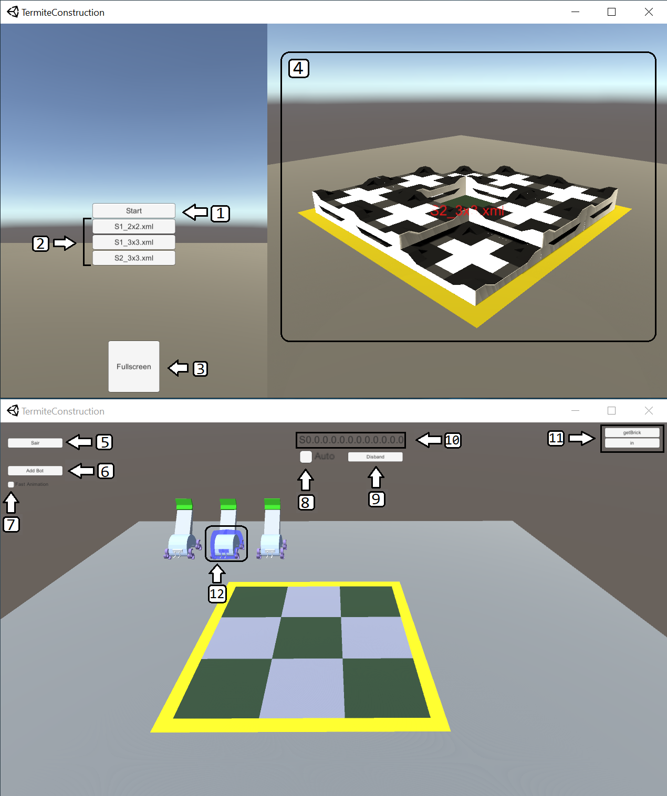
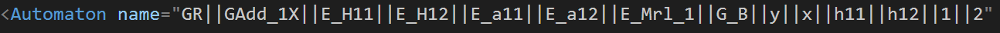

# TermiteConstruction

## Interface

1. *Start*: Inicia a simulação do cenário escolhido.
1. *Cenários*: Seleciona o cenário desejado. (Entre os arquivos XML disponíveis)
1. *Botão Fullscreen*: Alterna entre o modo da tela.
1. *Pré-Visualização*: Visualização da estrutura final do cenário.
1. *Sair*: Retorna ao menu.
1. *Add Bot*: Adiciona um robô. (Caso permitido no cenário)
1. *Fast Animation*: Ativa animações instantâneas.
1. *Auto*: Alterna entre modo automático e manual.
1. *Disband*: Remove robô do cenário.
1. *Estado*: Mostra o estado atual do robô selecionado.
1. *Eventos*: Permite selecionar os eventos no modo manual do robô.
1. *Robô Selecionado*: Borda azul que indica que o robô esta selecionado.

## Câmera e Controle

**Pré-Vizualizador**: Botão esquerdo do mouse para girar a camera e *scroll* para controlar o zoom.

**Simulador**: Controles do pré-visualizador + *WASD* para mover a câmera e *shift* para aumentar a velocidade. Para selecionar um robô basta clicar sobre ele com o botão esquerdo do mouse.

## Adicionando novos cenários
Para adicionar novos cenários ao simulador basta mover o arquivo XML desejado à pasta ".../TermiteSim/Assets/Resources/Supervisors". 
O arquivo necessita de um automato com nome conforme indicado no modelo da figura 

## Bugs Conhecidos

- Logo no início da simulação dois robôs podem tentar colocar um *title* nas posições de entrada e saída ocasionando um *crash* no sistema. Tomar cuidado quando inicializar o modo automático para não acontecer isso.

- As vezes os robôs decidem ir executar uma ação que utiliza a mesma posição do *grid*, caso algum dos robôs não tenha outra possibilidade de ação, é possível que os robôs fiquem "confusos".
- Desabilitar o modo automático e selecionar um evento para o robô cancela a execução do evento atual com um bug gráfico.
